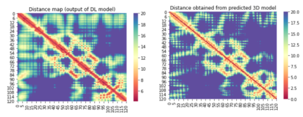

# Predicting 3D models of COVID-19 related proteins guided by predicted inter-residue distances
(For the 10 COVID-19 related proteins released by CASP Commons)

## Our structure prediction method
* Our overall method is demonstrated [here](./Full-Pipeline.md)
* Full details are yet to be published

## Our method for the COVID-19 protein targets
| Target  | L  | e-value threshold for running DeepMSA  | # of sequences in alignment  | # of Rosetta models built |
|---|---|---|---|---|
| C1901 | 638 | 0.001 | 249  | ?  |
| C1902 |   |   |   |   |
| C1903 |   |   |   |   |

## Distance map predictions vs distance map from the best Rosetta model
#### C1901
?
#### C1902
?
#### C1903
?
#### C1908
  
...
#### C1910
?

# Team
1. Badri Adhikari (adhikarib@umsl.edu)
1. Jacob Barger (jsbp67@mail.umsl.edu)
1. Bikash Shrestha (bsmmy@mail.umsl.edu)

# Contact
Badri Adhikari  
adhikarib@umsl.edu  
University of Missouri-St. Louis  
