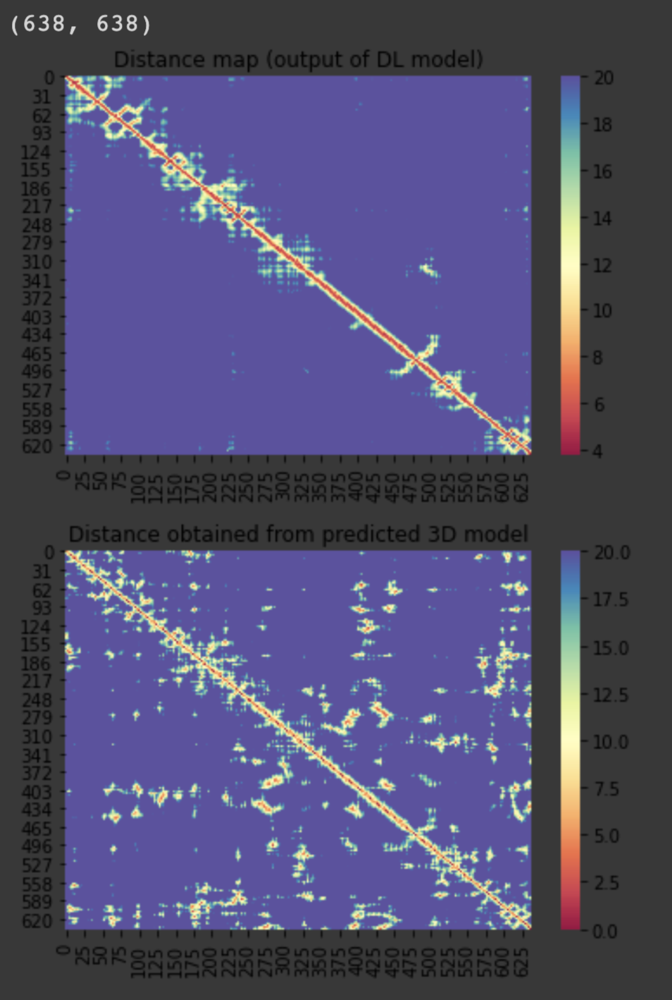
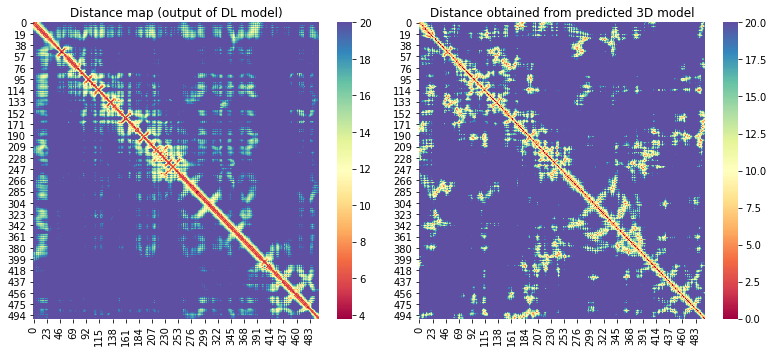
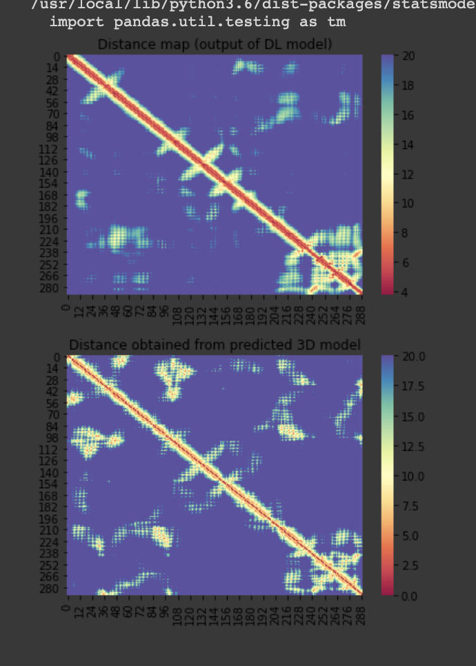
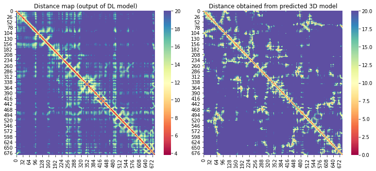
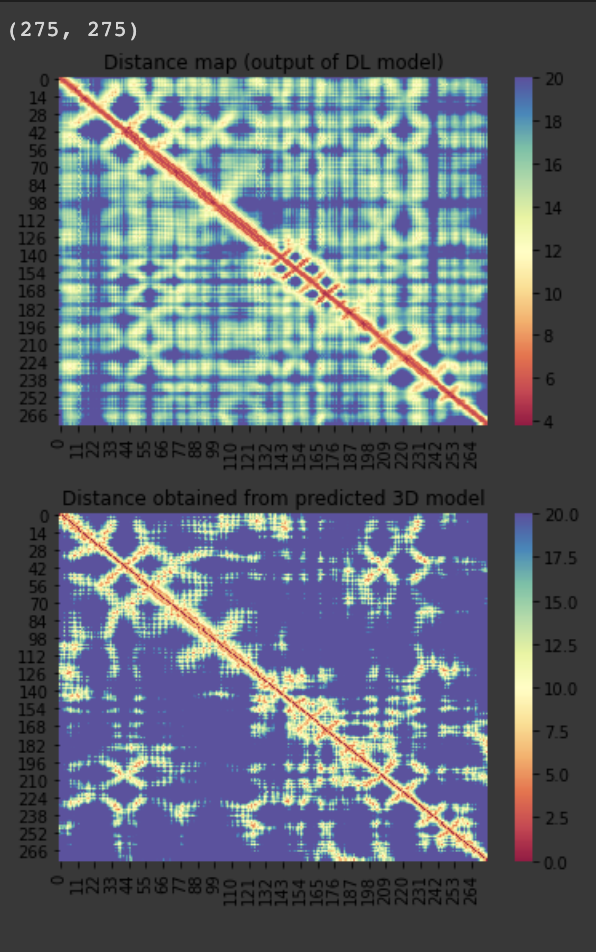
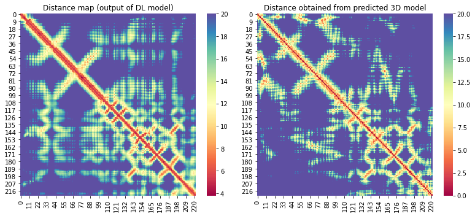
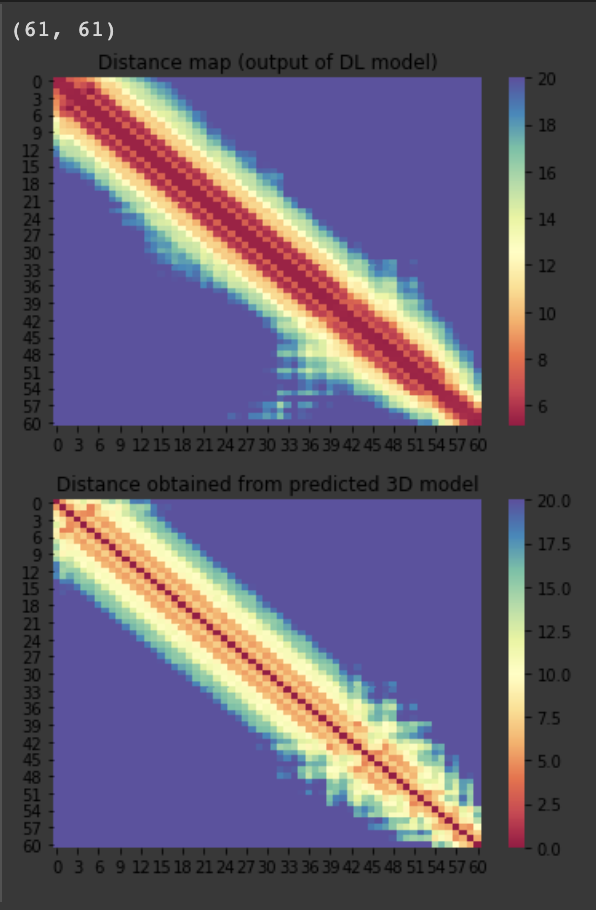
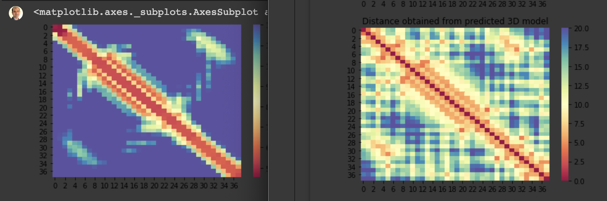
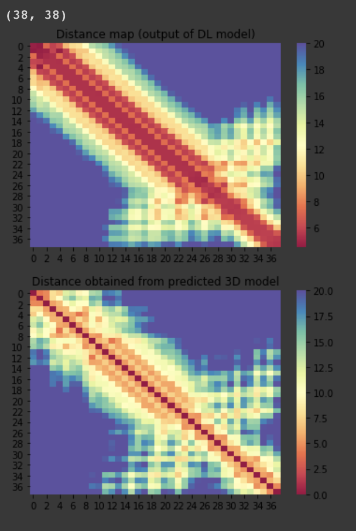

# 3D models of COVID-19 related proteins guided by predicted inter-residue distances
For the 10 COVID-19 related proteins released by CASP Commons

## Our structure prediction method
* Our overall method is demonstrated [here](./Full-Pipeline.md)
* Full details are yet to be published

## Our method for the COVID-19 protein targets
| Protein (target)  | L  | Aln. size (e-value = 0.001) | Aln. size (e-value = 0.1) | # of models |
|---|---|---|---|---|
| C1901 | 638 | 249  | -  | 25 |
| C1902 | 500  | 499  | - | 17 |
| C1903 | 290  | 357  | -  | 150 |
| C1904 | 686  | 166  |  - | 12 |
| C1905 | 275  | 26  |  - | 200 |
| C1906 | 222  | 160  | -  | 100 |
| C1907 | 61  |  12 |  - |350 |
| C1908 | 121  |  12 | 1919  | 420 |
| C1909 | 38  |  1 | 1  | 600 |
| C1910 | 43  | 4  |  2141 | 410 |
 
## Distance map predictions vs distance map from the best Rosetta model
#### C1901

#### C1902

#### C1903

#### C1904

#### C1904

#### C1906

#### C1904

#### C1908
##### Model 1
  
##### Model 2

#### C1909
##### Model 1
  
##### Model 2

...
#### C1910

# Team
1. Badri Adhikari (adhikarib@umsl.edu)
1. Jacob Barger (jsbp67@mail.umsl.edu)
1. Bikash Shrestha (bsmmy@mail.umsl.edu)

# Contact
Badri Adhikari  
adhikarib@umsl.edu  
University of Missouri-St. Louis  
